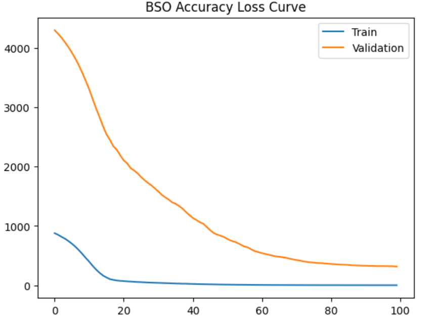

🌡️ AI-Based Urban Water Tank Temperature Control.
Hybrid Optimization using PSO + Bat Algorithm (BSO),
📌 Project Overview

Urban water tanks often experience excessive temperature rise during summers, leading to poor water quality, discomfort, and higher energy usage for cooling or replacement.

This project proposes an AI-driven solution using a hybrid optimization model (BSO) that combines:

Particle Swarm Optimization (PSO) for feature weight optimization

Bat Algorithm (BA) for neural network hyperparameter tuning

Artificial Neural Network (ANN) for temperature prediction

The system predicts water temperature behavior and helps optimize insulation and shading strategies for urban public water management.

🎯 Objectives

Predict water tank temperature accurately using ANN

Optimize feature influence using PSO

Optimize ANN architecture using Bat Algorithm

Visualize performance using multiple graphs

Save all results in structured formats for analysis and reuse

🧠 Model Architecture
🔹 Hybrid BSO Pipeline
Dataset (Excel)
   ↓
Preprocessing & Scaling
   ↓
PSO → Feature Weight Optimization
   ↓
BA → ANN Hyperparameter Optimization
   ↓
ANN Training
   ↓
Prediction + Evaluation

⚙️ Technologies Used
Category	Tools
Language	Python
ML / DL	TensorFlow (Keras), Scikit-Learn
Optimization	Custom PSO, Custom Bat Algorithm
Data Handling	Pandas, NumPy
Visualization	Matplotlib, Seaborn
Serialization	H5, CSV, JSON, YAML, PKL
📂 Project Structure
Urban Water Tank Temperature Control/
│
├── bso_ann_model.h5
├── bso_scaler.pkl
├── bso_model_config.yaml
├── bso_predictions.json
├── bso_results.csv
├── bso_training_metrics.json
│
├── bso_accuracy_loss.png
├── bso_actual_vs_predicted.png
├── bso_heatmap.png
├── bso_prediction_trend.png
│
├── results_all_improvements_city_to_tourism.xlsx
└── README.md

📊 Output Visualizations

Accuracy / Loss Curve – Model convergence

Actual vs Predicted Scatter Plot – Prediction quality

Feature Correlation Heatmap – Data relationships

Prediction Trend Graph – Time/index-wise comparison

All graphs are displayed on screen and saved automatically.

📈 Performance Metrics

The following metrics are computed and stored:

RMSE (Train & Test)

R² Score (Train & Test)

Optimized ANN parameters

PSO-derived feature weights

Saved in:

bso_training_metrics.json

🧪 Dataset

Input File:

results_all_improvements_city_to_tourism.xlsx

Features include (example):

Weather conditions

Urban parameters

Material-related indicators

Environmental improvement metrics

Target:

Water temperature / improvement score (numeric)

🚀 How to Run

Install dependencies:

pip install numpy pandas scikit-learn tensorflow matplotlib seaborn pyyaml joblib

Place dataset inside:

Urban Water Tank Temperature Control/

Run the script:

python bso_pso_ba_model.py

View results:

Graphs will appear on screen

All outputs saved automatically with bso_ prefix

🧩 Key Advantages

✔ Hybrid metaheuristic optimization
✔ No external optimization libraries
✔ Fully reproducible & explainable
✔ Suitable for Smart Cities & Public Infrastructure
✔ Ready for research papers, theses, and GitHub portfolios

🔮 Future Enhancements

Add WOA / QPSO / CSA comparison

GIS-based tank location mapping

Real-time IoT sensor integration

Web dashboard for municipal use

👨‍💻 Author

Sagnik Patra
AI & Optimization Researcher
